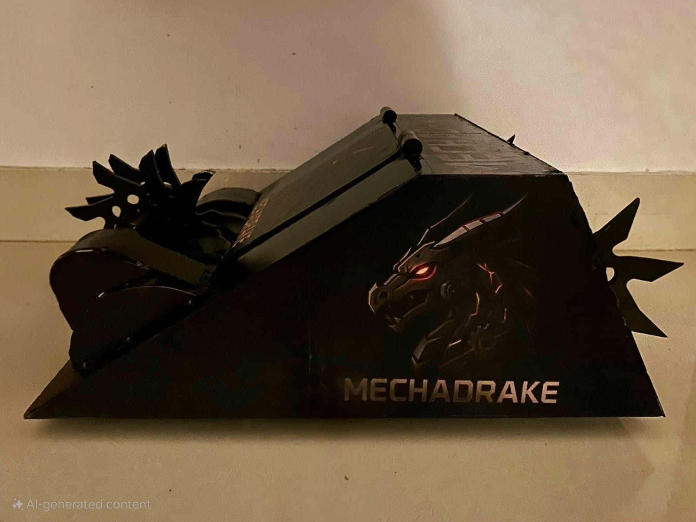
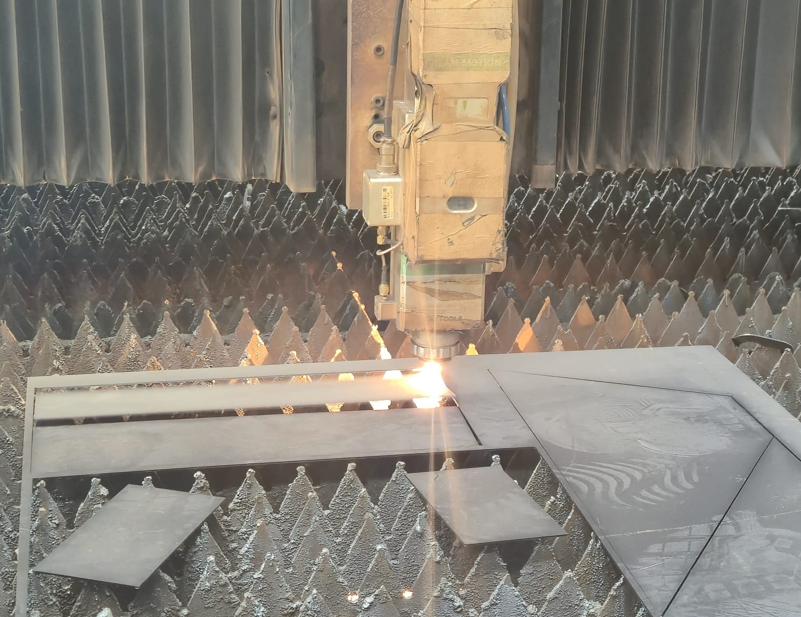

# 🐉 MechaDrake Combat Robot

**Developer:** Swarnendu Bhattacharjee  
**Type:** Multi-MCU Combat Robot (Arduino + ESP32 + Raspberry Pi)  
**Category:** Robotics • Embedded Systems • AI Vision • Autonomous Systems  

---

## ⚔️ Overview

**MechaDrake** is a fully custom-built combat robot engineered **from scratch**, integrating **mechanical design**, **multi-controller coordination**, and **AI-based decision systems**.  
The system merges **low-level microcontroller firmware** with **high-level computer vision and strategic AI**, creating a real-time, distributed architecture capable of adapting to combat conditions dynamically.

This project represents a complete, end-to-end build — from **CAD design and chassis fabrication** to **PCB development**, **firmware programming**, **wireless telemetry**, and **AI-assisted targeting**.  
Every line of code, every module, and every assembly was designed, debugged, and tested in-house.

---
### Build Images

<p align="center">
  
</p>

<p align="center">
  
</p>

---

## 🧩 System Architecture

| Layer | Controller | Responsibility |
|:------|:------------|:---------------|
| **Drive & Weapon Control** | Arduino Uno / Mega | PWM-based motor actuation and weapon servo control |
| **Wireless Communication** | ESP32 | Wi-Fi / Bluetooth-based remote operation and telemetry feedback |
| **AI & Vision Layer** | Raspberry Pi 4 | Object detection, motion tracking, and autonomous decision modules |
| **Sensor Integration** | Arduino + ESP32 | IMU, ultrasonic, and LIDAR sensing for obstacle detection and orientation |

The system communicates across serial, I²C, and TCP bridges — forming a **hybrid control network** capable of both manual and autonomous operation.

---

## 🧠 Core Highlights

- **Custom-engineered chassis** for impact absorption and torque balance  
- **Dual-microcontroller synchronization** between Arduino and ESP32  
- **Raspberry Pi AI module** powered by OpenCV + lightweight neural models  
- **Dynamic mode switching** (Autonomous ↔ Manual) in real-time  
- **Onboard data logging and telemetry stream** to the base station  
- **AI-assisted weapon control** for predictive actuation timing  

---

## 🔩 Hardware & Build

The entire structure — including the drivetrain, weapon assembly, and shock-mounted electronics bay — was **mechanically designed and fabricated manually**, using:
- CNC-cut aluminum frame  
- High-torque brushless DC motors (for drive)
- Custom gearbox for weapon arm  
- 3D-printed protective mounts for sensors and ESCs  
- Li-Po based modular power architecture (split for logic and drive sections)

---

## 🧠 Software & Firmware Design

**Distributed Control Strategy:**

- **Arduino Firmware:**  
  Handles all real-time motion control (motors, servos, sensors) at <10 ms loop latency.  

- **ESP32 Firmware:**  
  Responsible for communication, telemetry, and signal integrity over Wi-Fi and Bluetooth.  

- **Raspberry Pi Core (Python):**  
  Processes real-time camera feed and uses a trained lightweight model for enemy detection and trajectory prediction.  

This division ensures **low-level precision** and **high-level intelligence** coexist without performance bottlenecks.

---

## 🧪 Testing & Performance

- Achieved **stable control at 180+ RPM wheel speed** under dynamic load.  
- **Sensor fusion** from IMU + ultrasonic improves path correction.  
- **AI targeting latency:** ~120 ms (optimized using threaded video pipeline).  
- Modular debug ports for OTA firmware updates and serial monitoring.  

---

## ⚙️ Getting Started

Clone the repository:
```bash
git clone https://github.com/Swarnendu-Bhattacharjee/MechaDrake-Combat-Robot.git
cd MechaDrake-Combat-Robot

Raspberry Pi Setup

python3 -m venv venv
source venv/bin/activate
pip install -r requirements.txt

Arduino / ESP32 Setup

Upload .ino files from /firmware/arduino and /firmware/esp32 using Arduino IDE.

📸 Media & Documentation

All images, build videos, and renders are available in /media/.
Detailed architecture and wiring diagrams are stored in /docs/.

🧾 License

MIT License © 2025 Swarnendu Bhattacharjee

💬 Notes

This project is part of a long-term exploration into mechanical autonomy and AI-guided robotics — blending engineering precision with adaptive intelligence.
It is a demonstration of end-to-end system design, from metal to machine learning — entirely self-built.

“From raw materials to neural control — MechaDrake was not assembled, it was forged.”

---
